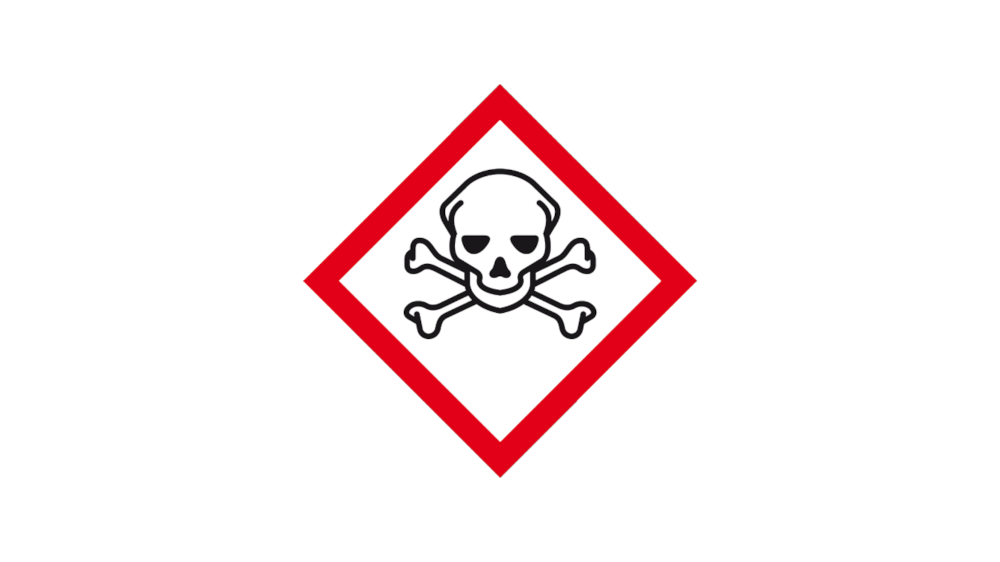

.. _home:

.. title:: home

.. raw:: html

    
<i>After 2002, as article 6, other groups than described</i>

    
<b><h2>OTP-CR-117/19</h2></b>
 
    
“Under the Rome Statute, the Court may only exercise jurisdicition over genocide, crimes against humanity and war crimes, as defined in the Rome Statute (Articles 6 to 8), when committed on or after 1 July 2002 (Article 11).”

     
    
The court should define how to deal with genocide on other groups than described.

    
Prosecutor and Court can act together and stop king netherlands his genocide.

.. toctree::
    :hidden:
    :glob:

    evidence
    guilty
    reconsider
    request
    writings
    source
    man
    mobile
    conclusion
