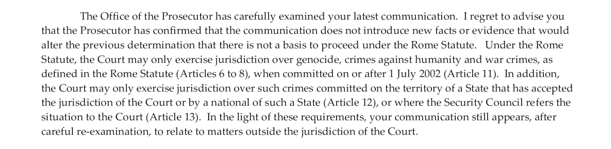

GENOCIDE
########

With the laws that give instructions to “treat” certain groups in the population
and the medicine used in that treatement turns out to be poison, the kingdom of 
the netherlands is, with the signature of the king, committing the following 
crimes mentioned in article 6:

| *   Killing members of the group
| *   Causing serious bodily or mental harm to members of the group
| *   Imposing measures intended to prevent births within the group

INSIDE THE JURISDICTION 
=======================

The prosecutor may, at any time, reconsider a decision whether to initiate an 
investigation or prosecution based on new facts or information AND  shall
not preclude the prosecutor from considering further information submitted
to him or her. 

So this case is not closable for any further reconsideration and the arrest
of the king, and thus the end of his genocide, is 1 decision away. 

"inside the jurisdiction" - :ref:`source <source>`

COOPERATION
===========

I read this as: "By adding Article 11 to the requirements, the prosecutor is actualy calling 
it a genocide and is missing the cooperation of the netherlands to arrest 
it’s own king and thus stop the kings genocide."

CLOZAPINE
=========

.. image:: ECHAclozapine.png

INFORMED
========

.. image:: informed.jpg

KING
====

.. image:: opdehoogte.jpg
    
NOT CRIMINAL
============

.. image:: OTP1.png

OUTSIDE THE JURISDICTION 
========================

.. image:: OTP2.png

.. toctree::
    :hidden:
    :glob:

    *
    txt/*
