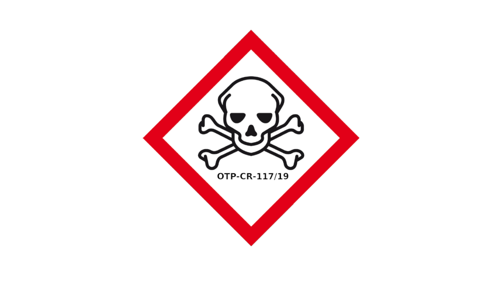

.. _home:

.. raw:: html

      

.. title:: home

.. raw:: html

       

    
<i>“Under the Rome Statute, the Court may only exercise jurisdicition over genocide, crimes against humanity and war crimes, as defined in the Rome Statute (Articles 6 to 8), when committed on or after 1 July 2002 (Article 11).”</i>

.. toctree::
    :hidden:
    :glob:

    evidence
    guilty
    reconsider
    request
    writings
    source
    man
    mobile
    conclusion
