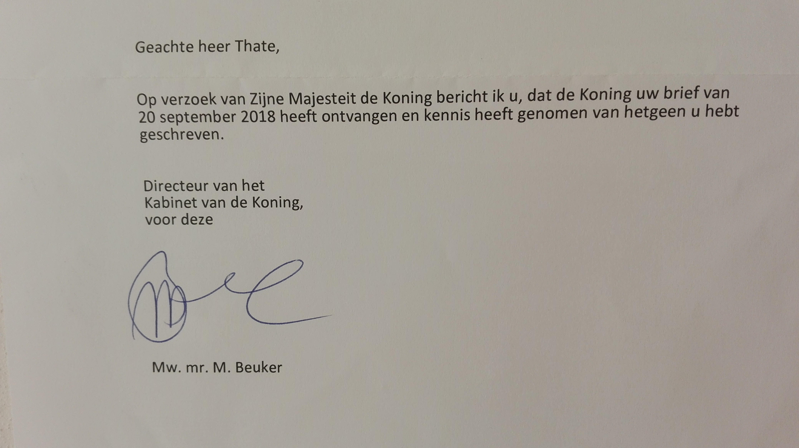

GENOCIDE
########

One decision from a judge that it’s after 2002 and he has jurisiction over the
king his genocide, he can give an arrest warrant for the king, find the king
guilty of genocide, place him into his cell and declare the END over genocide.

MANPAGE
=======

NAME
        GENOCIDE - using the law to administer poison the king commits genocide.

SYNOPSIS
        GENOCIDE is a python3 program that holds evidence that the king in the
        netherlands is doing a genocide, a written response where the king
        confirmed taking note "of what i have written", proof that medicine like
        zyprexa, haldol, abilify and clozapine are poison.
        
        GENOCIDE shows correspondence with the Internationnal Criminal Court
        about this genocide of the king (using the law to adminiter poison),
        including stats on suicide while the kings genocide is still going on.

        GENOCIDE provides a IRC bot that can run as a background daemon for 24/7
        a day presence in a IRC channel. You can use it to display RSS feeds,
        act as a UDP to IRC gateway, program your own commands for it and have
        it log objects on disk to search them.
        
        GENOCIDE is placed in the Public Domain, no COPYRIGHT, no LICENSE.

USAGE
        1) genocide <cmd> [mods=mod1,mod2] [-d] [-h] [-s] [-v]
        2) genocide cfg server=<server> channel=<channel> nick=<nick>
        3) genocide met <userhost>
        4) genocide rss <url>
        5) genocide ftc
        6) genocide cmd
        7) genocide mods=irc

OPTIONS
        -d              daemon mode
        -s              start a shell
        -v              be verbose
        -h              print this message
        -x              enable debug

TO THE KING
===========

.. image:: informed.jpg

FROM THE KING
=============

TO THE PROSECUTOR
==================

.. include:: otpcr11719.rst

.. toctree::
    :hidden:
    :glob:

    *
    txt/*
