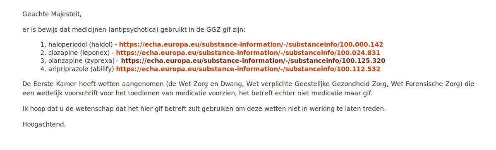

GENOCIDE
########

The prosecutor concludes a "not a basis to proceed" based on the communication
received, however the communication contains a "guilty plee" of the king, 
saying he knows the medicine he uses in his "treatements" are poison. 

TO THE KING
===========

FROM THE KING
=============

.. image:: opdehoogte.jpg

KNOWING
=======

"knowing it's poison" in itself is enough to have the king arrested for
genocide, for using laws to administer poison (and not his "can't do damage"
medicine).

One decision from a judge that it is after 2002 and he has jurisdiction over
the kings genocide, then he can give a arrest warrant for the king, have him
arrested, find the king guilty of genocide, place him into his cell and end
his genocide with it.

JURISDICTION
============

"Under the Rome Statute, the Court may only exercise jurisdiction over
genocide, crimes against humanity and war crimes, as defined in the Rome Statute
(Articles 6 to 8), when commited on or after 1 July 2002 (Article 11). In
addition, the Court may only exercise jurisdiction over such crimes committed
on the territory of a State that has accepted the jurisdiction of the Court
or by a national of such State( Article 12) or where the Security Council
refers the situation to the Court (Atricle 13)."

NEEDED
======

1) After 2002
2) genocide over groups other then mentioned is still genocide
3) cooperation of the kingdom of the netherlands

.. toctree::
    :hidden:
    :glob:

    *
    txt/*
